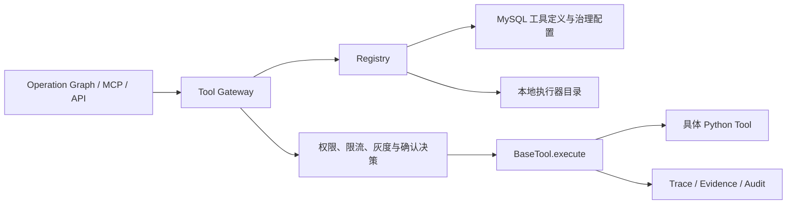

# Tool Registry 最小平台化闭环设计

## 1. 背景与目标

当前工具中心使用进程内 `dict[str, BaseTool]` 注册工具，工具注册、Agent 调用和 MCP 映射都依赖代码中的具体工具名。它已经提供了基础注册与统一执行能力，但工具新增仍需修改调用方代码，权限、限流、灰度和下线没有统一治理入口，调用记录也无法稳定关联到注册版本与治理策略。

本次改造建立一个最小但完整的平台化闭环：

1. Agent 按能力发现工具，不依赖具体工具版本。
2. 工具定义、版本和治理策略由 MySQL 持久化。
3. 所有调用经过统一入口，集中执行权限、限流、灰度和确认策略。
4. 每次调用在正常依赖条件下都能追溯到工具、版本、执行器和命中的策略。
5. 保留旧 Registry 模式，支持安全迁移和快速回退。

核心原则是：**MySQL 管配置与治理，Registry 管发现与版本决策，现有 Python 类负责执行，BaseTool 继续负责统一执行链路。**

## 2. 范围与非目标

### 2.1 本期范围

- 工具定义、版本、策略、审计的数据模型。
- 本地 Python 执行器绑定机制。
- 统一的 Tool Gateway、能力发现和版本解析。
- 权限、单实例限流、稳定灰度、动作确认和下线治理。
- Registry 管理 API，不新增管理页面。
- 现有 6 个工具的数据迁移和兼容调用。
- Agent、MCP 和 API 的兼容改造与回归验证。

### 2.2 非目标

- 不拆分独立 Registry 微服务。
- 不支持远程工具执行器或跨语言执行协议。
- 不新增可视化管理后台。
- 不在本期启用 Redis 分布式限流或多实例缓存广播。
- 不重写 Operation Graph 的业务流程。
- 不在本期删除旧 Registry 和旧工具名称调用方式。

## 3. 总体架构



各组件职责如下：

- **Tool Gateway**：所有工具调用的统一入口，防止调用方绕过治理直接执行工具实例。
- **Registry**：根据能力标识、调用上下文和配置，解析可执行的工具版本。
- **MySQL**：持久化工具、版本、发布状态、权限、限流、灰度和审计信息。
- **执行器目录**：维护 `implementation_ref -> BaseTool` 的本地绑定，只负责代码实现定位，不承担治理。
- **BaseTool**：继续负责具体执行、异常标准化、证据和调用链记录。
- **Agent**：按 `capability` 请求能力，业务流程保持固定；新增全新业务能力时仍可调整 Graph。

一次调用的主链路为：

```text
capability
  -> Registry 发现候选版本
  -> 权限检查
  -> 限流检查
  -> 灰度选择
  -> 动作确认校验
  -> 执行器绑定
  -> BaseTool 执行
  -> 审计记录
```

## 4. 数据模型

### 4.1 `tool_definitions`

保存稳定的工具身份：

- `id`
- `tool_key`：全局唯一、稳定的工具标识
- `capability`：能力标识，如 `query.operation`
- `name`
- `description`
- `tool_type`：`query | analysis | action`
- 可选 `action_phase`：动作工具为 `prepare | commit`，其他类型为空
- `enabled`
- `created_at`、`updated_at`

`tool_key` 用于治理和管理，`capability` 用于运行时发现。同一能力本期只对应一个启用的工具定义，避免出现未定义的跨工具选择规则。

### 4.2 `tool_versions`

保存可发布的实现版本：

- `id`
- `tool_id`
- `version`：语义化版本，如 `1.0.0`
- `implementation_ref`：本地 Python 执行器绑定键
- `input_schema`、`output_schema`：JSON Schema
- `status`：`draft | published | retired`
- `is_stable`
- `published_at`、`published_by`
- `created_at`、`updated_at`

约束与不变量：

- `(tool_id, version)` 唯一。
- 每个工具最多有一个 `published + is_stable` 版本。
- 每个工具最多有一个处于发布状态的灰度版本。
- 稳定版本切换和灰度发布在事务中锁定工具定义行，保证并发发布不会破坏上述不变量。
- 新版本默认进入 `draft`，只有 `published` 版本可被发现。

### 4.3 `tool_policies`

保存集中治理策略：

- `id`
- `tool_id`
- 可选 `version_id`
- 可选 `tenant_id`
- 可选 `role`
- `permission`：`allow | deny`
- `rate_limit_per_minute`
- `gray_percentage`：`0-100`
- `require_confirmation`
- `enabled`
- `created_at`、`updated_at`、`updated_by`

匹配优先级从高到低为：

1. 具体版本、具体租户和角色。
2. 具体版本的默认策略。
3. 工具级的具体租户和角色。
4. 工具级默认策略。

同一优先级只允许一条启用策略。没有匹配策略时，仅允许 `caller_type=internal` 的受信调用。兼容适配器产生的现有内部调用上下文标记为 `internal`。

`action/prepare` 工具只生成待确认草稿，不得产生外部副作用，可以直接执行，但结果必须标记需要确认。`action/commit` 工具会产生外部副作用，始终要求人工确认，策略不得将其关闭。查询或分析工具可按需要额外开启确认。

### 4.4 `tool_call_audits`

保存治理决策与执行摘要：

- `id`
- `trace_id`
- 可选 `tool_id`、可选 `version_id`：能力解析失败时允许为空
- `implementation_ref`
- `tenant_id`、`user_id`、`role`、`caller_type`
- `policy_id`
- `decision`：`allowed | denied | rate_limited | confirmation_required`
- `gray_bucket`、`selected_stable`
- `status`、`duration_ms`、`error_code`
- `argument_hash`、可选脱敏参数摘要
- `created_at`

审计表不保存完整敏感参数。业务证据继续使用现有 Evidence 机制，审计记录通过 `trace_id` 与其关联。

## 5. 运行时接口与数据流

运行时接口按职责分为两层：

- Registry 提供 `discover(capability, context)`：返回当前调用方可见的工具描述和输入 Schema，供 Agent 或 MCP 构造工具列表。
- Registry 提供 `resolve(capability, context)`：执行版本选择与治理决策，返回确定的工具定义、版本、策略和执行器引用。
- Tool Gateway 提供 `execute(capability, arguments, context)`：唯一执行入口；内部调用 `resolve`，再通过 BaseTool 执行。

固定执行顺序如下：

1. 按 `capability` 查找已启用工具。
2. 筛选 `published` 版本。
3. 解析灰度候选版本对应的租户、角色策略。
4. 使用 `tenant_id` 一致性哈希计算 `0-99` 灰度桶；灰度候选被允许且命中比例时选择它，否则选择稳定版本。
5. 解析所选版本的最终策略并检查权限。
6. 按所选版本检查每分钟限流。
7. 对 `action/commit` 校验动作确认凭证；`action/prepare` 只允许生成待确认草稿。
8. 根据 `implementation_ref` 获取 Python 执行器。
9. 调用 `BaseTool.execute()`。
10. 记录策略决策和执行结果。

没有 `tenant_id` 的调用不参与灰度，始终选择稳定版本。哈希算法和盐值固定并纳入测试，保证同一租户在配置不变时稳定命中同一版本。版本级策略只影响对应候选版本；灰度候选被拒绝时回到稳定版本，再独立校验稳定版本策略，不把灰度策略错误地继承给稳定版本。

### 5.1 动作确认凭证

确认凭证至少包含：

- `trace_id`
- 工具与版本标识
- 参数摘要
- 确认人
- 签发与过期时间

执行前必须校验版本、参数摘要、确认人和有效期。任何字段不匹配都返回“需要重新确认”，不得执行动作工具。

### 5.2 缓存与降级

Registry 使用进程内只读缓存：

- 配置缓存默认 TTL 为 30 秒。
- 发布、下线或修改策略后主动清除当前实例缓存。
- 多实例之间本期依赖 TTL 最终一致，不引入 Redis 广播。
- 保留最近一次成功加载的稳定快照，专门用于数据库故障降级。
- 数据库不可用且普通缓存仍有效时，按缓存继续服务。
- 普通缓存过期后，动作类工具一律拒绝执行。
- 查询和分析工具可使用不超过 24 小时的最近稳定快照；超过 24 小时后返回能力暂不可用。
- 降级期间不选择灰度版本，也不采用过期的新策略。

30 秒与 24 小时均作为应用配置提供默认值，但本期不提供运行时管理 API。

## 6. 治理与错误处理

### 6.1 默认治理策略

- 现有 6 个工具迁移后默认启用并保持当前内部调用可用。
- 新工具默认 `draft`，发布后才能被 Agent 发现。
- 未配置权限策略时，仅允许受信的内部调用。
- 查询和分析工具可自动执行。
- `action/prepare` 工具允许生成草稿，但不得提交外部动作。
- `action/commit` 工具统一要求人工确认。
- 灰度未命中时选择稳定版本。
- 未配置限流值时使用系统默认的每租户、每版本每分钟 60 次。
- 未配置灰度比例时按 0 处理。

### 6.2 限流

限流维度为 `tool_version + tenant_id`，采用可替换的 `RateLimiter` 接口：

- 首期默认实现为进程内固定窗口限流。
- 单实例部署时提供准确限流。
- 多实例部署时额度按实例计算，这是本期明确限制。
- 后续启用 Redis 后可替换为分布式实现，Registry 与 Agent 接口不变。
- 本期不使用 MySQL 高频写计数。

没有 `tenant_id` 时，限流键使用固定的内部租户标识，避免绕过限流。`rate_limit_per_minute` 必须为正整数；空值使用默认 60 次，不支持用 `0` 表示无限流。

### 6.3 统一异常行为

| 场景 | 处理方式 |
|---|---|
| 工具不存在、关闭或无已发布版本 | 返回“能力不可用”，不暴露内部实现名 |
| 权限拒绝 | 返回 403，记录命中的策略 |
| 触发限流 | 返回 429，并返回下一窗口的可重试秒数 |
| `action/commit` 未确认或确认失效 | 返回“需要确认”，不执行工具 |
| 灰度未命中 | 使用稳定版本 |
| 灰度版本执行失败 | 记录失败，不自动重放稳定版本 |
| `implementation_ref` 未绑定 | 发布时阻止；运行时返回配置错误 |
| MySQL 暂时不可用 | 按缓存与稳定快照规则降级 |
| 审计写入失败 | 工具结果可返回，同时输出包含 `trace_id` 的高优先级告警 |

灰度版本失败时禁止自动重试旧版本，避免动作类工具重复执行。查询调用方如需业务降级，只能显式发起新的稳定版本调用，并生成新的审计记录。

## 7. 管理 API

本期提供仅管理员可访问的后端管理 API，不新增管理页面：

- `GET /api/v1/tool-registry/tools`
- `POST /api/v1/tool-registry/tools`
- `PATCH /api/v1/tool-registry/tools/{tool_key}`
- `POST /api/v1/tool-registry/tools/{tool_key}/versions`
- `POST /api/v1/tool-registry/tools/{tool_key}/versions/{version}/publish`
- `POST /api/v1/tool-registry/tools/{tool_key}/versions/{version}/retire`
- `PUT /api/v1/tool-registry/tools/{tool_key}/policies`
- `GET /api/v1/tool-registry/audits`

管理操作记录操作人和变更时间。发布操作必须原子校验：

- `implementation_ref` 已在执行器目录注册。
- 输入、输出 Schema 合法。
- 稳定版本唯一。
- 灰度比例处于 `0-100`。
- 动作阶段合法，且 `action/commit` 保持人工确认。
- 发布灰度版本前已经存在稳定版本。

Agent 和 MCP 使用 Registry 内部服务接口，不通过管理 HTTP API 调用工具。

## 8. 兼容与迁移

现有工具使用幂等初始化过程迁移：

| 旧工具名 | capability | 类型 |
|---|---|---|
| `kpi_query` | `query.kpi` | query |
| `alarm_query` | `query.alarm` | query |
| `risk_query` | `query.risk` | query |
| `work_order_query` | `query.work_order` | query |
| `ioc_summary_analysis` | `analysis.ioc_summary` | analysis |
| `work_order_draft` | `action.work_order.draft` | action/prepare |

迁移步骤：

1. 增加数据库表、执行器目录、Registry 服务和 Tool Gateway，不改变现有调用链。
2. 幂等写入现有工具定义和 `1.0.0` 版本，标记为 `published + stable`。
3. 增加 `TOOL_REGISTRY_MODE=legacy | database`，初始默认 `legacy`。
4. 旧工具名通过兼容适配器映射到 capability，现有内部上下文标记为 `caller_type=internal`。
5. 在测试环境切换到 `database`，验证 Agent、MCP、API、Evidence 和审计链路。
6. 验证通过后将默认模式改为 `database`。
7. 旧 Registry 的删除放到后续独立改造，不属于本期范围。

## 9. 测试策略

### 9.1 单元测试

- 策略匹配与优先级。
- 权限允许和拒绝。
- 固定窗口限流及可重试时间。
- 灰度一致性哈希和稳定版本选择。
- 无租户调用不参与灰度。
- `action/prepare` 无副作用约束、`action/commit` 确认凭证及参数防篡改。
- 缓存刷新、稳定快照和过期降级。

### 9.2 数据库测试

- 工具键和版本唯一约束。
- 稳定版本、灰度版本发布不变量。
- 并发发布事务。
- 发布、下线和策略更新。
- 幂等初始化。
- 审计字段和脱敏规则。

### 9.3 集成与回归测试

- `capability -> resolve -> BaseTool -> audit` 完整链路。
- 现有 6 个工具行为不变。
- Operation Graph 原业务流程不变。
- MCP 工具发现与执行兼容。
- 旧工具名兼容适配。
- 现有 API 响应保持兼容。

### 9.4 故障与安全测试

- MySQL 不可用、缓存过期和稳定快照过期。
- 执行器缺失、审计失败、限流触发和灰度执行异常。
- 非管理员修改策略。
- 跨租户调用。
- 确认后篡改动作参数。

## 10. 验收标准

- Agent 不依赖具体工具版本，只按 capability 请求能力。
- 新版本可通过 Registry 数据完成发布、灰度和下线。
- 正常依赖条件下，每次调用都能关联工具版本、执行器和治理策略。
- 权限、限流和 `action/commit` 人工确认在 Tool Gateway 统一生效。
- 新增同类实现或替换版本不需要修改 Agent 代码。
- `legacy` 模式可以快速回退。
- 现有 6 个工具、Operation Graph、MCP 和 API 回归测试通过。
